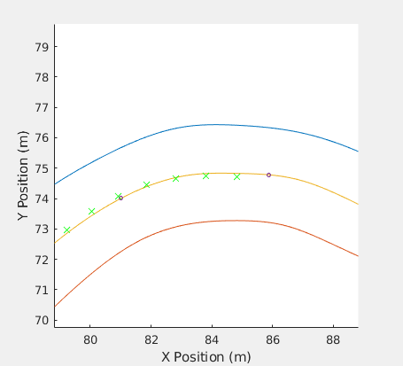
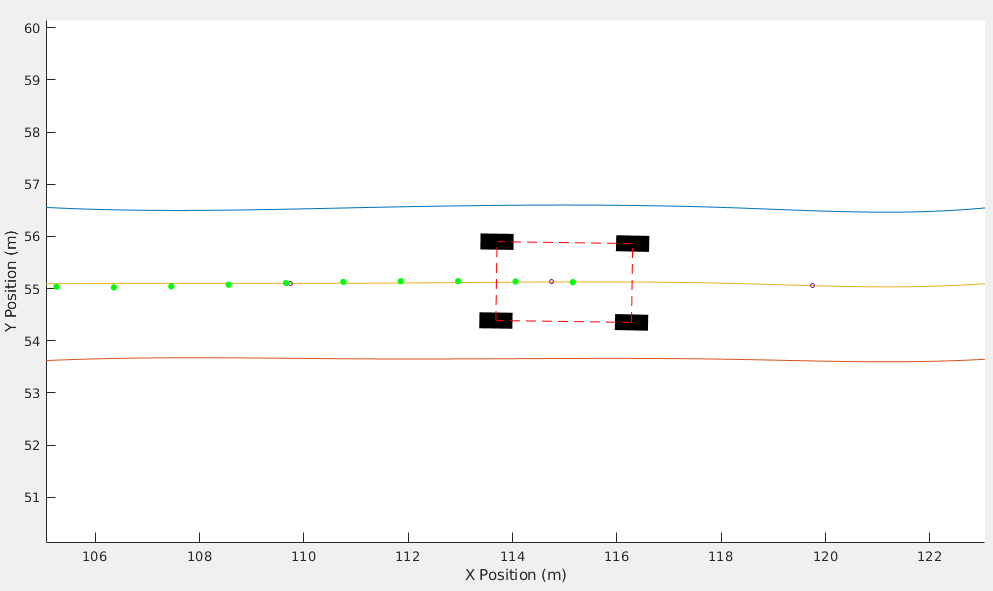
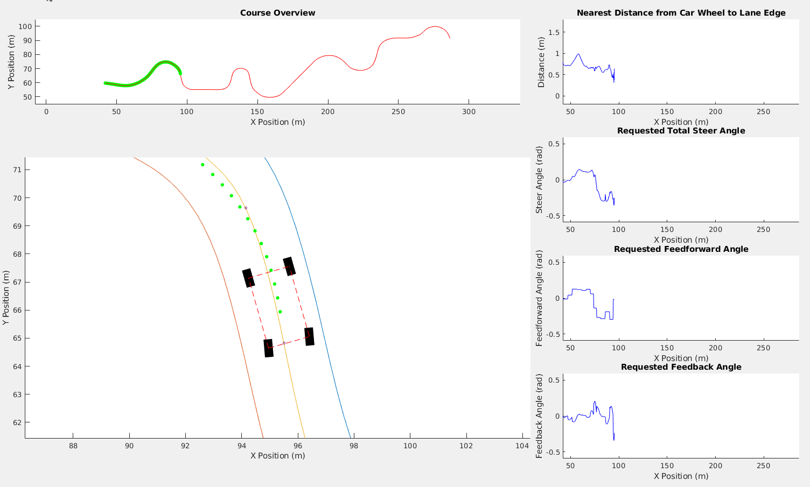

# car_simulator

This repo's current state is just to showcase what was done previously when I was in college. One day, I will reimplement some version of this (most likely in python) because the original source code is in the Upside Down. The simulation wasn't the crux but definetely helped our team win 2nd place in the SAE AutoDrive Challenge. An article about the event can be found [here](https://tees.tamu.edu/news/2018/05/texas-am-engineering-autodrive-challenge-team-takes-second-overall-in-first-competition-milestone.html).

## Summary

The goal at the time was to create a dynamics car simulation for lateral controls to follow a given path. It was difficult to get testing time with the vehicle because so many applications being developed in parallel, so simulation seemed like a great option to create. We utilized matlab for quick development time.

Fortunately, here are a couple of gifs which showcases the iterations for the simulation.

In the following diagram, a car's center of gravity was tracked. A constant velocity input of 10 m/s (~22 mph) and a predetermined path (yellow line) in a form of waypoint (dots on the yellow line) were given. With this data, the lateral controller paired with a path tracker are able to control the steering angle to follow the path.  

In the following diagram, a car's wheels were added to check if they ever touched the lane lines (blue and orange lines). In this case, a constant velocity input of 11 m/s (~25mph) was sent out. With this data, the lateral controller paired with a path tracker are able to control the steering angle to follow the path.  

In the following diagram, an overview was added to keep track of important metrics during runtime. The top graph shows the overall course's progress. The top right graph shows the wheel closest to the lane lines. The next one below shows the total steering angle. The two below the total steering graph shows the requested feedforward and feedback steering angle. This overall helped us understand where to correct some errors and gain tuning for the controller.

